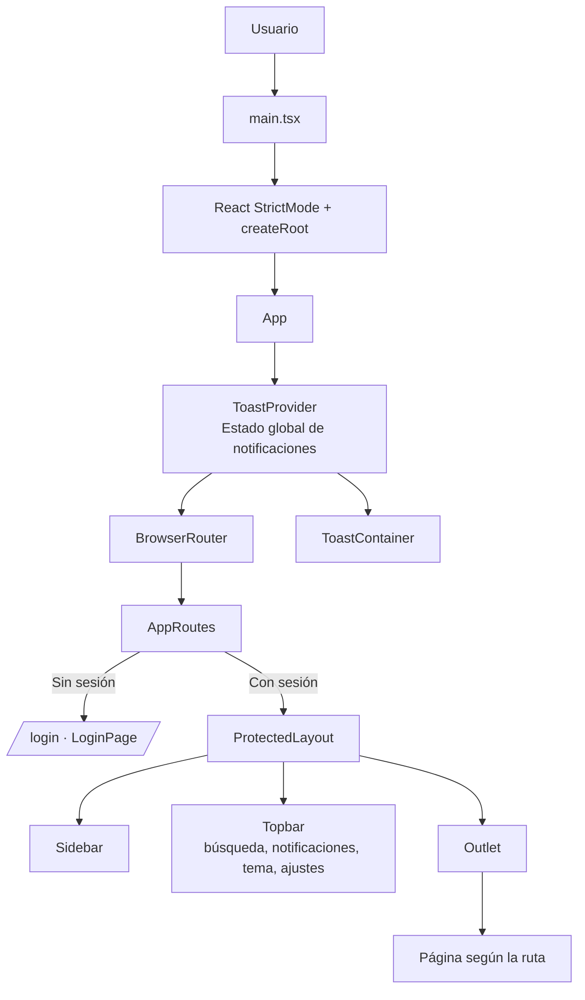
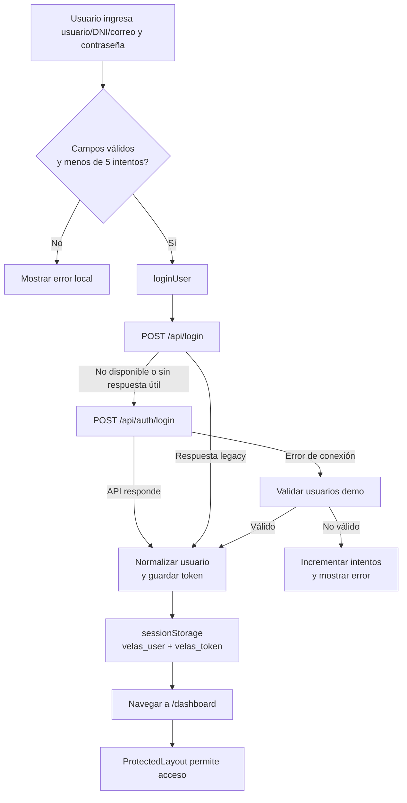
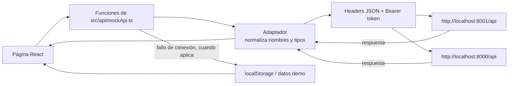
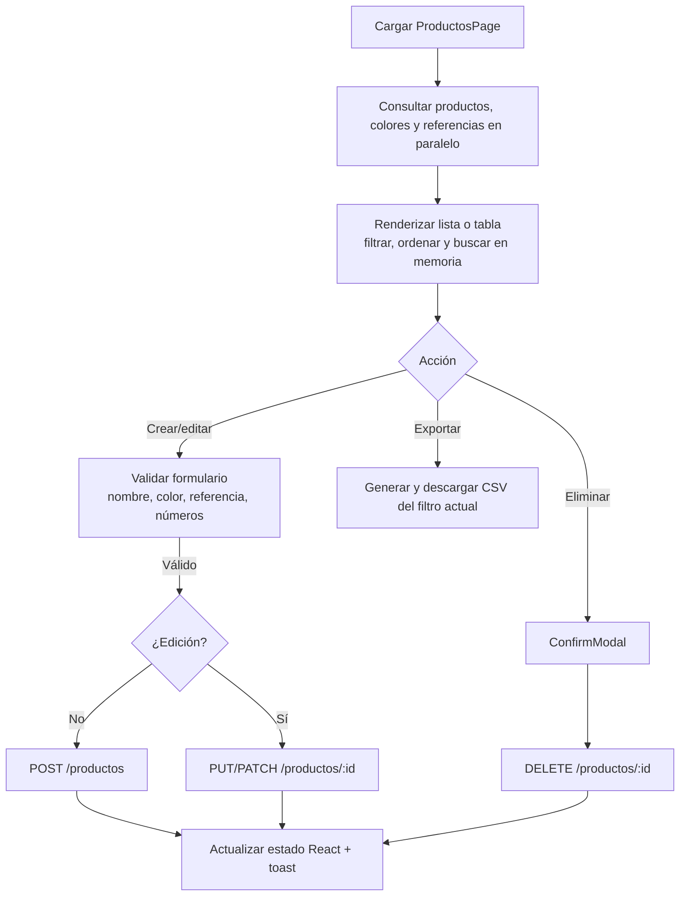
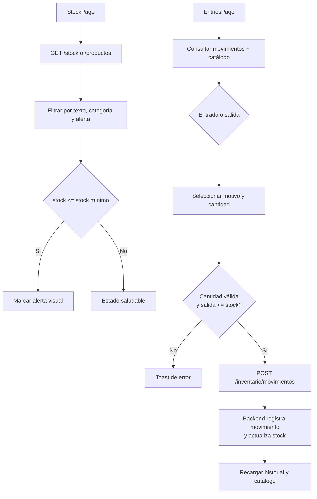
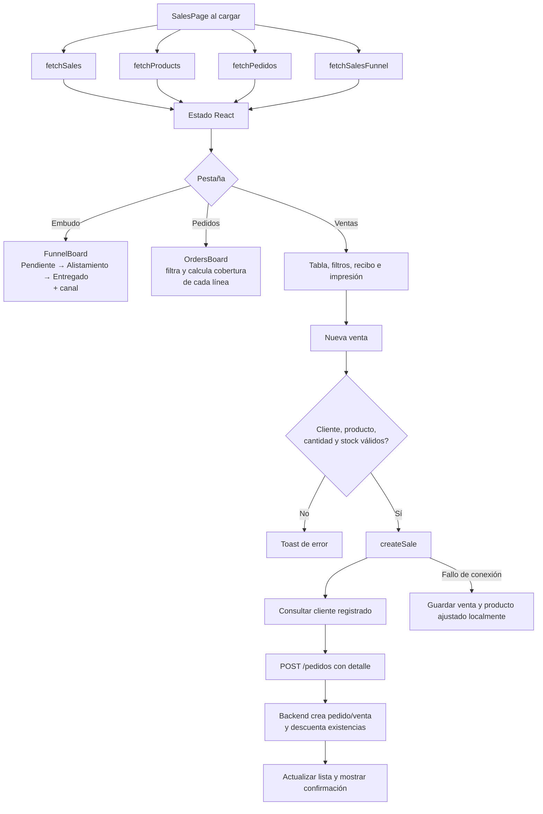
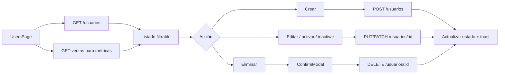
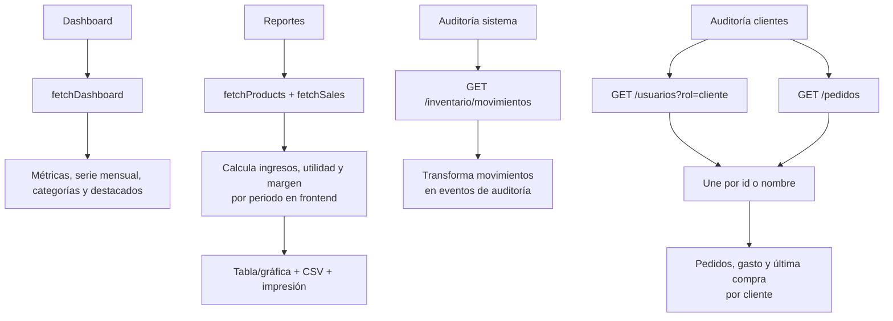

# Diagrama técnico de procesos — Frontend

Este documento describe el frontend actual de **Velas Estrella de David**. Es una SPA construida con React 19, TypeScript, Vite y React Router. La capa `src/api/mockApi.ts` conserva ese nombre, pero funciona como adaptador entre la interfaz y la API FastAPI, incluyendo un modo local de respaldo.

## 1. Arquitectura y arranque



**Explicación para presentar:** `main.tsx` monta una única aplicación React. `App` instala dos servicios transversales: el enrutador y las notificaciones. `AppRoutes` recupera la sesión desde `sessionStorage` y decide si entrega el login o el contenedor protegido. Dentro del contenedor, `Outlet` sustituye únicamente el contenido central al cambiar de módulo; el menú y la barra superior permanecen.

## 2. Control de acceso, sesión y tema



- La sesión se mantiene por pestaña en `sessionStorage`; al cerrar sesión se eliminan `velas_user` y `velas_token`.
- Cada solicitud HTTP agrega `Authorization: Bearer <token>` si hay token.
- El tema se lee y persiste en `localStorage` (`velas_theme`); `ProtectedLayout` actualiza `data-theme` del `body`.
- La protección es de interfaz: si no existe usuario se redirige a `/login`. El backend debe conservar la validación real de permisos.

## 3. Rutas y módulos

| Ruta | Página | Propósito técnico | Fuente principal |
|---|---|---|---|
| `/dashboard` | `DashboardPage` | Indicadores, gráficas, accesos rápidos y alertas. | `fetchDashboard()` |
| `/productos` | `ProductsPage` | CRUD del catálogo y consulta de colores/referencias. | Productos, colores, referencias |
| `/stock` | `StockPage` | Vista filtrable de existencias y alertas. | `fetchStock()` |
| `/entradas` | `EntriesPage` | Entradas, salidas y su historial. | Movimientos + productos |
| `/ventas` | `SalesPage` | Embudo, pedidos, ventas, recibos y nueva venta. | Ventas, pedidos, productos, reportes |
| `/reportes` | `ReportsPage` | Métricas de rentabilidad, periodos y exportación. | Productos + ventas |
| `/usuarios` | `UsersPage` | CRUD, estado y resumen de usuarios. | Usuarios + ventas |
| `/auditoria` | `AuditPage` | Consulta de movimientos como trazabilidad del sistema. | Movimientos de inventario |
| `/auditoria-clientes` | `CustomerAuditPage` | Consulta de clientes y trazabilidad comercial. | Usuarios cliente + pedidos |

## 4. Capa de datos: API, normalización y modo local



La aplicación intenta primero los dos puertos de API. El adaptador traduce el contrato del backend —por ejemplo, `id_producto`, `stock_actual` y `nombre`— a tipos de interfaz como `Product { id, stock, name }`. Para operaciones y consultas soportadas, si no hay conexión usa datos demo o `localStorage`; esto permite demo offline, pero no equivale a persistencia centralizada.

Persistencias locales relevantes:

- `sessionStorage`: `velas_user`, `velas_token`, `loginAttempts`.
- `localStorage`: `velas_theme`, `velas_products`, `velas_users`, `velas_sales`, `velas_inventory_movements`.

## 5. Procesos de negocio principales

### 5.1 Catálogo de productos



El catálogo mantiene filtros, orden, modo de visualización y formularios en estado local de React. Crear, editar y eliminar actualiza el estado de la pantalla después de la respuesta; en modo sin servidor las operaciones se reflejan en `localStorage`.

### 5.2 Inventario: stock y movimientos



Las entradas se asocian a **Producción** o **Reembolso**; las salidas a **Daño** o **Defecto**. La página de movimientos valida el stock antes de enviar una salida. `StockPage` también ofrece botones de ajuste rápido, pero esos cambios son solo estado de esa vista: no llaman a API ni se guardan de forma durable; el proceso formal de inventario es `EntriesPage`.

### 5.3 Ventas, pedidos y embudo



Detalles importantes para explicar:

- El embudo agrupa estados **Pendiente**, **Alistamiento** y **Entregado**, y calcula los valores por canal (presencial, Facebook, WhatsApp).
- El tablero de pedidos calcula cobertura: `min(stock, pedido) / pedido * 100`, y el avance considera estado más preparación de líneas.
- Antes de crear una venta contra API, el cliente debe existir entre `/usuarios?rol=cliente`; si no existe, se rechaza la operación.
- El comprobante es una vista modal del registro seleccionado y se imprime con `window.print()`.

### 5.4 Usuarios y acceso administrativo



El formulario traduce el rol de interfaz `supremo` a `super_admin` y el rol `normal` a `admin` para el backend. Las métricas de ventas por usuario son estimadas en el frontend mediante los registros de ventas disponibles; no proceden de una asignación explícita de vendedor en esos datos.

### 5.5 Dashboard, reportes y auditorías



- Dashboard: presenta indicadores y navegación rápida; la alerta de stock lleva a `/stock`.
- Reportes: si no recibe un informe consolidado del backend, calcula valores estimados a partir de productos y ventas. Por ello sus indicadores deben interpretarse como analítica de interfaz/demostración mientras no exista un endpoint financiero específico.
- Auditoría del sistema: actualmente deriva eventos desde movimientos de inventario, con módulo fijo `Inventario`.
- Auditoría de clientes: es solo lectura; combina clientes y pedidos. Si no obtiene clientes del backend, deriva filas desde los nombres presentes en pedidos visibles.

## 6. Elementos transversales de interfaz

```mermaid
flowchart LR
  UI[Acción de usuario] --> ST[Estado local con useState/useMemo]
  ST --> RT[Re-render de componente]
  UI --> API[Llamada asíncrona a adaptador API]
  API --> ST
  ST --> TO[useToast]
  TO --> TC[ToastContainer\nmensaje de éxito, error, alerta o información]
  UI --> CP[CommandPalette / Sidebar / notificaciones]
  CP --> NAV[navigate(path)]
```

- `Sidebar`: navegación principal, perfil visible y cierre de sesión.
- `CommandPalette`: se abre desde la barra de búsqueda; filtra comandos y navega con clic, teclado o Enter. El acceso `Ctrl+K` dentro del componente gestiona el cierre si ya está abierto; la apertura visible la realiza el botón de la barra superior.
- Notificaciones: están en estado local de `ProtectedLayout`; se pueden marcar como leídas o silenciar, pero no se sincronizan con API.
- `ToastProvider`: mecanismo compartido para informar operaciones exitosas, errores de validación y descargas.
- Exportaciones: productos, usuarios, stock, ventas, movimientos, reportes y auditorías generan un `Blob` CSV en el navegador; no se solicita un archivo al backend.

## 7. Resumen breve para exposición

> El frontend es una SPA React organizada por módulos y rutas protegidas. Cada página obtiene información a través de un adaptador que normaliza la API FastAPI y adjunta el token de sesión. Los módulos de catálogo, usuarios, ventas e inventario validan la acción en el cliente, envían la operación a la API y actualizan la interfaz con mensajes de estado. Si la API no está disponible, varias funciones usan datos demo o `localStorage` para permitir una demostración offline. Dashboard, reportes y auditorías consumen o derivan información de los módulos operativos para ofrecer visualización y trazabilidad.

## 8. Límites técnicos actuales que conviene mencionar

1. La autorización real debe estar en el backend: el frontend solo redirige según haya sesión, no aplica control granular de roles a cada ruta.
2. El modo demo/local facilita pruebas, pero no ofrece concurrencia ni fuente única de verdad.
3. Los ajustes rápidos en la vista de stock no se persisten; para trazabilidad se deben usar entradas/salidas.
4. Parte de reportes, auditoría y métricas se calcula o deriva en el cliente cuando el backend no entrega datos consolidados.
5. Los datos de notificaciones son locales de la sesión de interfaz, no un sistema de notificaciones persistente.
