# Diagramas de procesos — API de frontend

Generados a partir del archivo frontend/API proporcionado.

## Alcance

Se documentan 34 funciones, incluyendo:

- utilidades de sessionStorage
- capa HTTP (apiRequest, apiFetchAny, apiFetch)
- normalizadores y manejo de errores
- autenticación
- dashboard, productos, usuarios, referencias y colores
- inventario
- pedidos/ventas
- stock, reportes y auditoría

> **Nota:** los diagramas representan el flujo lógico de cada función, incluyendo las ramas de fallback visibles en el código. Los nombres de endpoints se conservan tal como aparecen en el frontend.

## Índice

1. [getStoredProducts](#1-getstoredproducts)
2. [persistProducts](#2-persistproducts)
3. [getStoredUsers](#3-getstoredusers)
4. [persistUsers](#4-persistusers)
5. [getStoredToken](#5-getstoredtoken)
6. [apiRequest](#6-apirequest)
7. [apiFetchAny](#7-apifetchany)
8. [apiFetch](#8-apifetch)
9. [toFrontendRole](#9-tofrontendrole)
10. [toFrontendStatus](#10-tofrontendstatus)
11. [toDisplayName](#11-todisplayname)
12. [normalizeUser](#12-normalizeuser)
13. [normalizeProduct](#13-normalizeproduct)
14. [readResponseError](#14-readresponseerror)
15. [loginUser](#15-loginuser)
16. [fetchDashboard](#16-fetchdashboard)
17. [fetchProducts](#17-fetchproducts)
18. [createProduct](#18-createproduct)
19. [updateProduct](#19-updateproduct)
20. [deleteProduct](#20-deleteproduct)
21. [fetchUsers](#21-fetchusers)
22. [createUser](#22-createuser)
23. [updateUser](#23-updateuser)
24. [deleteUser](#24-deleteuser)
25. [fetchReferences](#25-fetchreferences)
26. [fetchColors](#26-fetchcolors)
27. [createInventoryEntry](#27-createinventoryentry)
28. [createInventoryExit](#28-createinventoryexit)
29. [createPedido](#29-createpedido)
30. [updatePedidoStatus](#30-updatepedidostatus)
31. [fetchSales](#31-fetchsales)
32. [fetchStock](#32-fetchstock)
33. [fetchReports](#33-fetchreports)
34. [fetchAudit](#34-fetchaudit)

---

## 1. getStoredProducts

```mermaid
flowchart TD
 A[Inicio] --> B[Leer sessionStorage: velas_products]
 B --> C{¿Existe raw?}
 C -- No --> D[Retornar []]
 C -- Sí --> E[JSON.parse]
 E --> F{¿Es Array?}
 F -- Sí --> G[Retornar productos]
 F -- No --> D
 E -. excepción .-> D
```

## 2. persistProducts

```mermaid
flowchart TD
 A[Inicio] --> B[JSON.stringify(products)]
 B --> C[sessionStorage.setItem velas_products]
 C --> D[Fin]
```

## 3. getStoredUsers

```mermaid
flowchart TD
 A[Inicio] --> B[Leer sessionStorage: velas_users]
 B --> C{¿Existe raw?}
 C -- No --> D[Retornar []]
 C -- Sí --> E[JSON.parse]
 E --> F{¿Es Array?}
 F -- Sí --> G[Retornar usuarios]
 F -- No --> D
 E -. excepción .-> D
```

## 4. persistUsers

```mermaid
flowchart TD
 A[Inicio] --> B[JSON.stringify(users)]
 B --> C[sessionStorage.setItem velas_users]
 C --> D[Fin]
```

## 5. getStoredToken

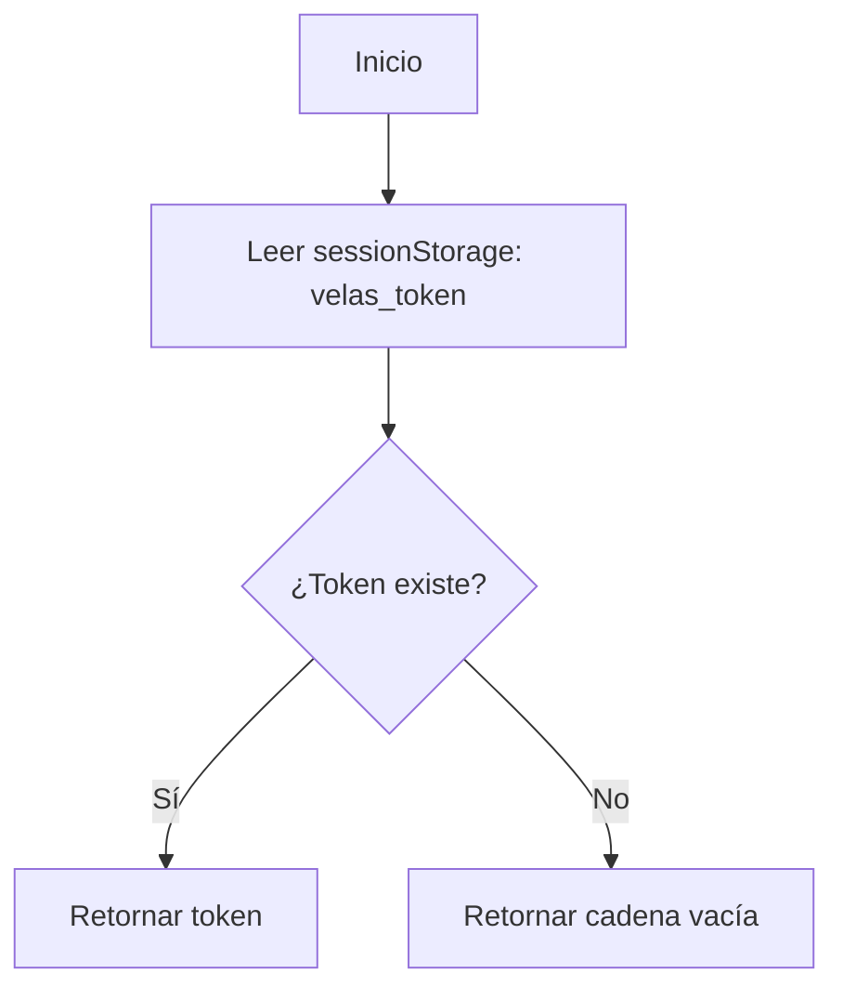

## 6. apiRequest

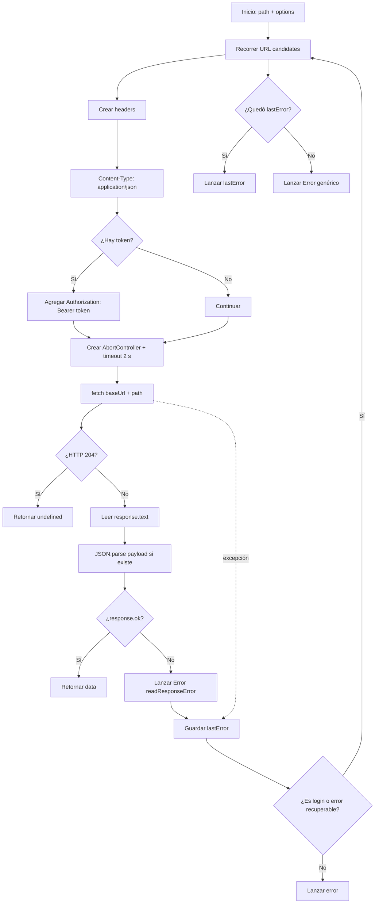

## 7. apiFetchAny

```mermaid
flowchart TD
 A[Inicio: lista de paths] --> B[Tomar siguiente path]
 B --> C[apiRequest(path, options)]
 C --> D{¿Éxito?}
 D -- Sí --> E[Retornar respuesta]
 D -- No --> F[Guardar lastError]
 F --> G{¿Quedan paths?}
 G -- Sí --> B
 G -- No --> H{¿Existe lastError?}
 H -- Sí --> I[Lanzar lastError]
 H -- No --> J[Lanzar Error genérico]
```

## 8. apiFetch

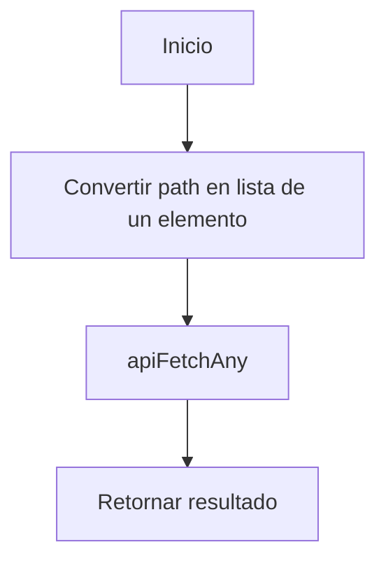

## 9. toFrontendRole

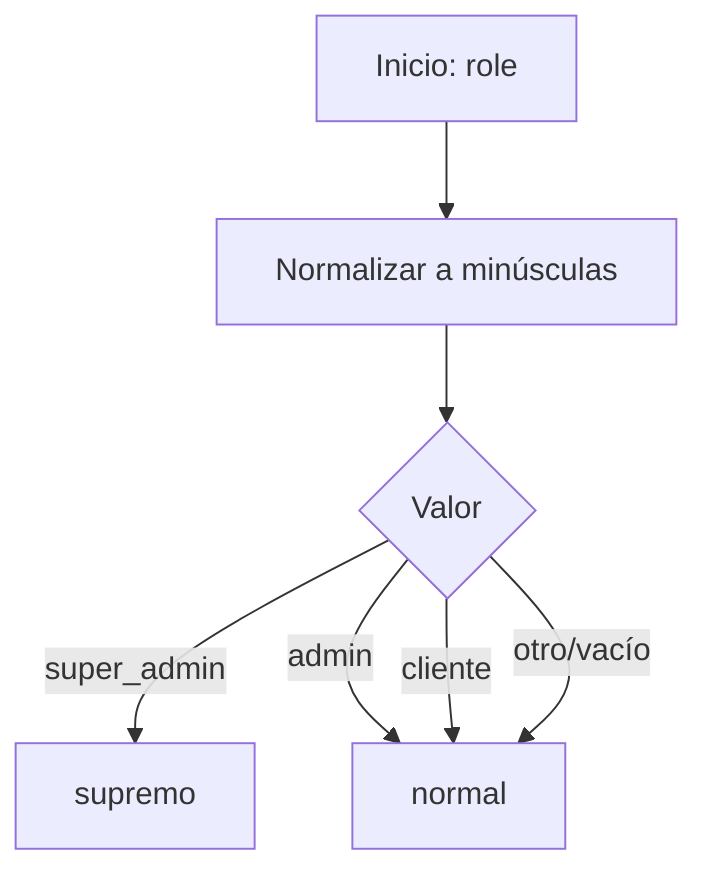

## 10. toFrontendStatus

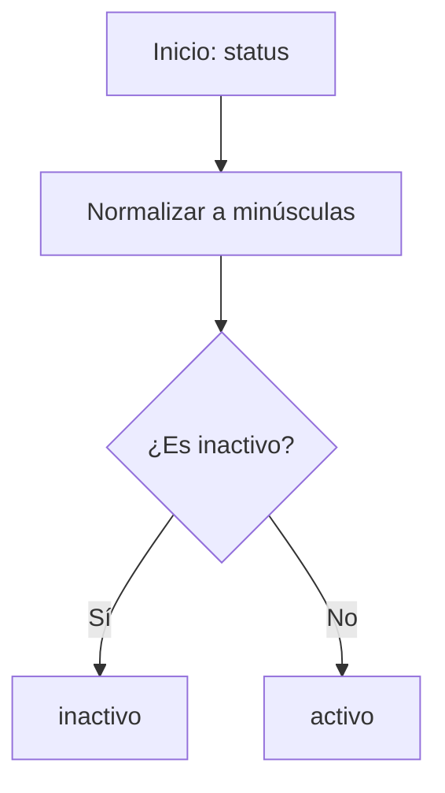

## 11. toDisplayName

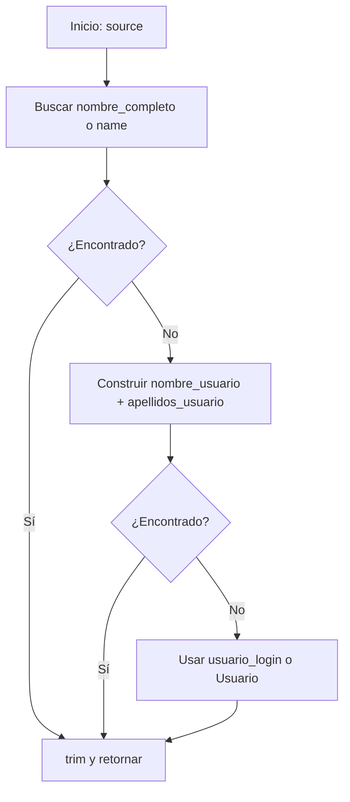

## 12. normalizeUser

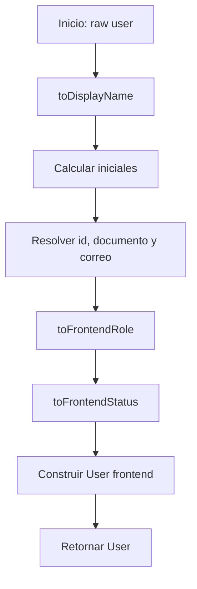

## 13. normalizeProduct

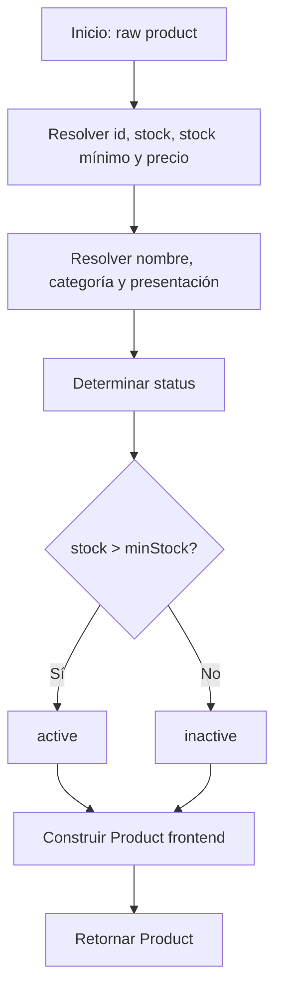

## 14. readResponseError

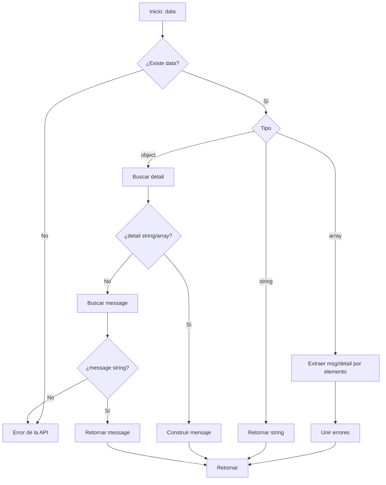

## 15. loginUser

```mermaid
flowchart TD
 A[Inicio: identifier + password] --> B[POST /auth/login]
 B --> C{¿Respuesta OK?}
 C -- No --> D[Lanzar error]
 C -- Sí --> E[Guardar access_token en sessionStorage]
 E --> F[normalizeUser(data.user)]
 F --> G[Guardar velas_user]
 G --> H[Retornar User]
```

## 16. fetchDashboard

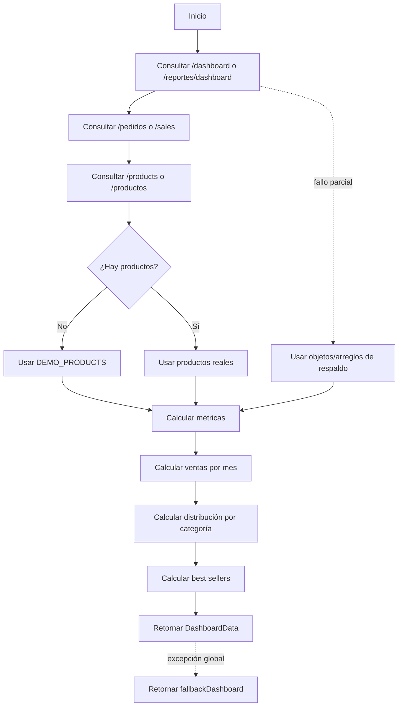

## 17. fetchProducts

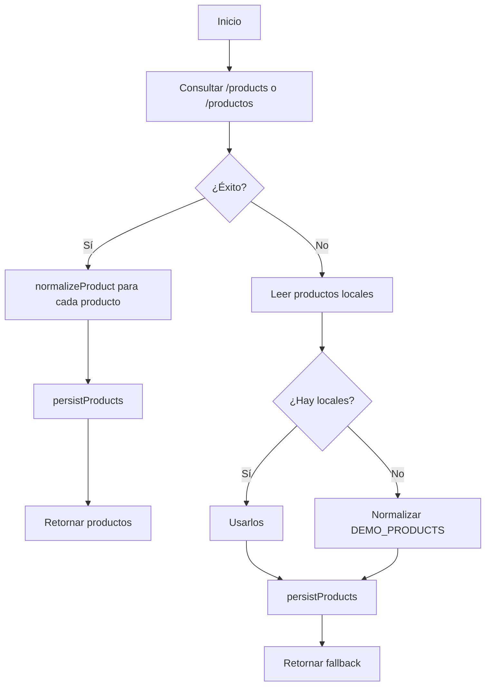

## 18. createProduct

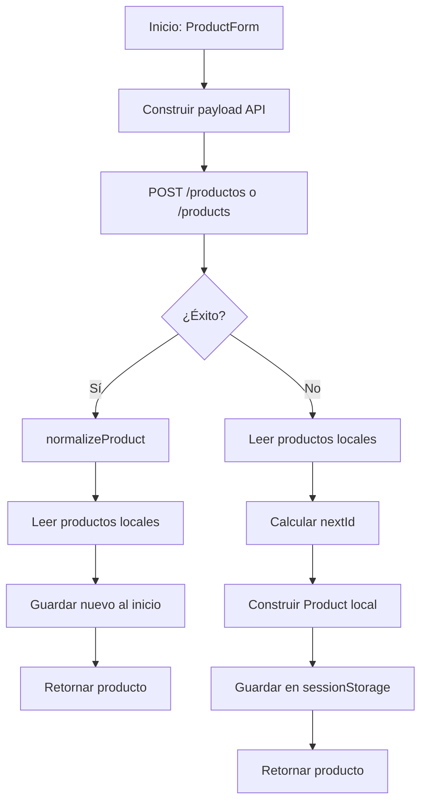

## 19. updateProduct

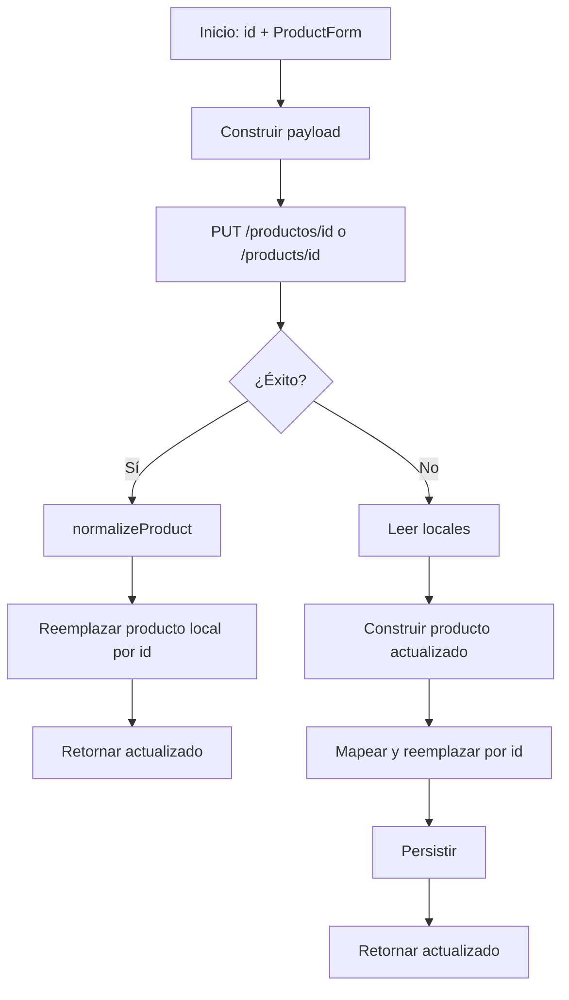

## 20. deleteProduct

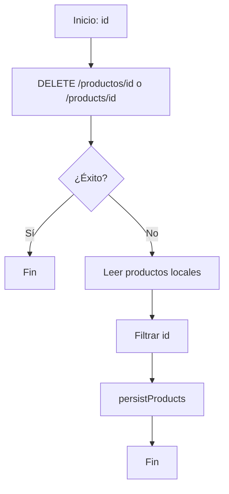

## 21. fetchUsers

```mermaid
flowchart TD
 A[Inicio] --> B[GET /usuarios o /users]
 B --> C{¿Éxito?}
 C -- Sí --> D[normalizeUser para cada usuario]
 D --> E[persistUsers]
 E --> F[Retornar usuarios]
 C -- No --> G[Leer usuarios locales]
 G --> H{¿Hay locales?}
 H -- Sí --> I[Usarlos]
 H -- No --> J[Usar DEMO_USERS]
 I --> K[persistUsers]
 J --> K
 K --> L[Retornar fallback]
```

## 22. createUser

```mermaid
flowchart TD
 A[Inicio: UserForm] --> B[Construir payload con defaults]
 B --> C[POST /usuarios o /users]
 C --> D{¿Éxito?}
 D -- Sí --> E[normalizeUser]
 E --> F[Leer usuarios locales]
 F --> G{¿ID ya existe?}
 G -- No --> H[Agregar al inicio y persistir]
 G -- Sí --> I[No duplicar]
 H --> J[Retornar usuario]
 I --> J
 D -- No --> K[Leer usuarios locales]
 K --> L[Calcular nextId]
 L --> M[Construir User local]
 M --> N[Persistir]
 N --> O[Retornar usuario]
```

## 23. updateUser

```mermaid
flowchart TD
 A[Inicio: id + UserForm] --> B[Construir payload]
 B --> C[PUT /usuarios/id o /users/id]
 C --> D{¿Éxito?}
 D -- Sí --> E[normalizeUser]
 E --> F[Reemplazar usuario local]
 F --> G[Retornar actualizado]
 D -- No --> H[Leer locales]
 H --> I[Construir User usando datos existentes como respaldo]
 I --> J[Reemplazar por id]
 J --> K[Persistir]
 K --> L[Retornar actualizado]
```

## 24. deleteUser

```mermaid
flowchart TD
 A[Inicio: id] --> B[DELETE /usuarios/id o /users/id]
 B --> C{¿Éxito?}
 C -- Sí --> D[Fin]
 C -- No --> E[Leer usuarios locales]
 E --> F[Filtrar id]
 F --> G[persistUsers]
 G --> H[Fin]
```

## 25. fetchReferences

```mermaid
flowchart TD
 A[Inicio] --> B[GET /referencias]
 B --> C{¿Éxito?}
 C -- Sí --> D[Mapear id_referencia → id]
 D --> E[Retornar lista]
 C -- No --> F[Retornar []]
```

## 26. fetchColors

```mermaid
flowchart TD
 A[Inicio] --> B[GET /colores]
 B --> C{¿Éxito?}
 C -- Sí --> D[Mapear id_color → id]
 D --> E[Retornar lista]
 C -- No --> F[Retornar []]
```

## 27. createInventoryEntry

```mermaid
flowchart TD
 A[Inicio: productId + quantity + type] --> B[Construir movimiento]
 B --> C[tipo_movimiento = entrada]
 C --> D[POST /inventario/movimientos]
 D --> E{¿Éxito?}
 E -- Sí --> F[Fin]
 E -- No --> G[Propagar error]
```

## 28. createInventoryExit

```mermaid
flowchart TD
 A[Inicio: productId + quantity + type] --> B[Construir movimiento]
 B --> C[tipo_movimiento = salida]
 C --> D[POST /inventario/movimientos]
 D --> E{¿Éxito?}
 E -- Sí --> F[Fin]
 E -- No --> G[Propagar error]
```

## 29. createPedido

```mermaid
flowchart TD
 A[Inicio: pedido] --> B[POST /pedidos]
 B --> C{¿Éxito?}
 C -- No --> D[Propagar error]
 C -- Sí --> E[Leer detalles]
 E --> F[Tomar primer detalle]
 F --> G[Mapear respuesta a Sale]
 G --> H[Mapear cada detalle]
 H --> I[Retornar Sale]
```

## 30. updatePedidoStatus

```mermaid
flowchart TD
 A[Inicio: id + status] --> B[PATCH /pedidos/id/estado]
 B --> C{¿Éxito?}
 C -- No --> D[Propagar error]
 C -- Sí --> E[Leer detalles]
 E --> F[Tomar primer detalle]
 F --> G[Mapear respuesta a Sale]
 G --> H[Retornar Sale]
```

## 31. fetchSales

```mermaid
flowchart TD
 A[Inicio] --> B[GET /pedidos o /sales]
 B --> C{¿Array con datos?}
 C -- No --> D[Lanzar error interno]
 C -- Sí --> E[Mapear cada venta]
 E --> F[Calcular % disponibilidad por detalle]
 F --> G[Retornar Sales]
 D --> H[Usar DEMO_SALES]
 H --> I[Mapear y calcular disponibilidad]
 I --> J[Retornar fallback]
```

## 32. fetchStock

```mermaid
flowchart TD
 A[Inicio] --> B[GET /stock, /productos o /products]
 B --> C{¿Éxito?}
 C -- Sí --> D[Mapear campos a StockItem]
 D --> E[Retornar stock]
 C -- No --> F[Convertir DEMO_PRODUCTS a StockItem]
 F --> G[Retornar fallback]
```

## 33. fetchReports

```mermaid
flowchart TD
 A[Inicio] --> B[En paralelo: fetchProducts + fetchSales]
 B --> C[Calcular inventoryRevenue]
 C --> D[Calcular salesRevenue]
 D --> E[Determinar revenueBase]
 E --> F[Calcular totalOrders]
 F --> G[Contar lowStock]
 G --> H[Generar tabla mensual con factores]
 H --> I[Construir cards]
 I --> J[Retornar ReportData]
```

## 34. fetchAudit

```mermaid
flowchart TD
 A[Inicio] --> B[GET /inventario/movimientos o /audit]
 B --> C{¿Éxito?}
 C -- No --> D[Usar []]
 C -- Sí --> E[Tomar máximo 10 movimientos]
 D --> E
 E --> F[Mapear usuario, acción, módulo y fecha]
 F --> G[Retornar AuditEntry[]]
```

---

## Arquitectura general

```mermaid
flowchart LR
 UI[Frontend / componentes] --> API[API frontend]
 API --> HTTP[Capa HTTP]
 HTTP --> BACKEND[Backend REST]
 HTTP --> SS[(sessionStorage)]
 API --> NORM[Normalizadores]
 API --> FALLBACK[Datos demo / fallback]
 BACKEND --> NORM
 NORM --> UI
 FALLBACK --> UI
```

## Observaciones importantes

1. La capa HTTP agrega `Content-Type: application/json` y, si existe, `Authorization: Bearer <token>`.
2. `apiRequest` usa un timeout de 2000 ms mediante `AbortController`.
3. Varias funciones intentan nombres alternativos de endpoint, por ejemplo `/productos` y `/products`.
4. Productos y usuarios tienen persistencia local en `sessionStorage` cuando la API falla.
5. Dashboard, ventas y stock incorporan datos demo como respaldo.
6. Las funciones de inventario y pedidos no tienen fallback local; si la petición falla, el error se propaga.
7. `fetchReports` combina productos y ventas y calcula métricas derivadas en el frontend.
8. `fetchAudit` limita el resultado a los primeros 10 movimientos.
